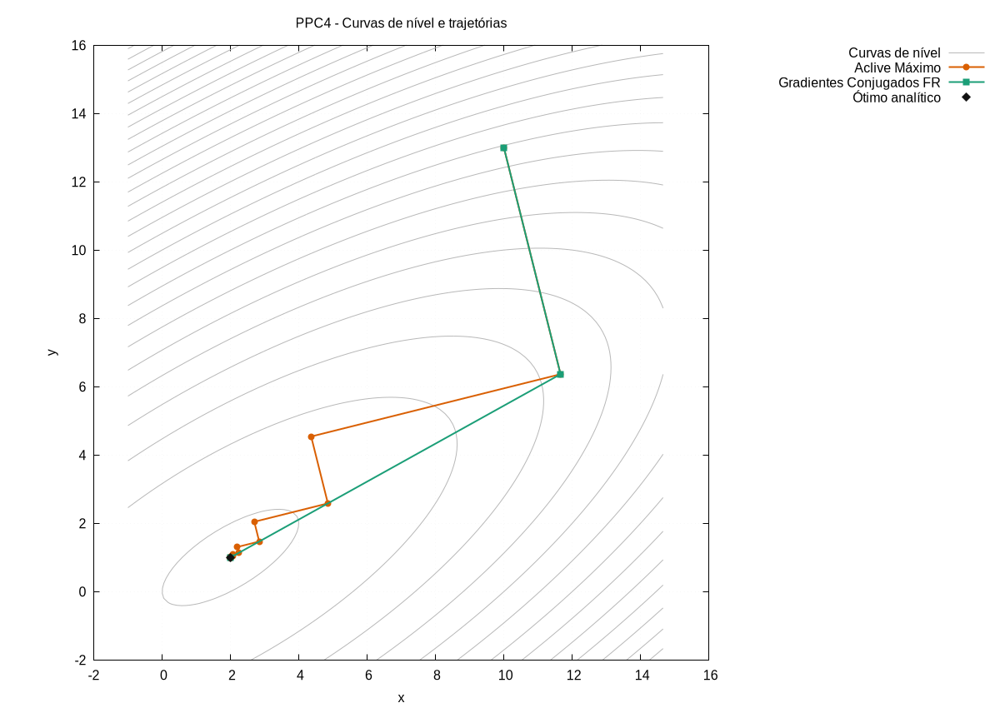

# PPC 04 - Otimização Bidimensional sem Restrições

Universidade de Brasília - UnB\
Faculdade de Tecnologia - FT\
Departamento de Engenharia Mecânica - ENM\
Disciplina: Cálculo Numérico Aplicado\
Semestre: 2026/1\
Aluno: Felipe Tavares Loureiro\
Professor: Rafael Gabler Gontijo

## 1. Resumo

Este diretório contém a implementação do Programa para Casa 04, cujo objetivo é resolver numericamente um problema de maximização bidimensional sem restrições.

A função objetivo estudada é:

f(x,y) = 2xy + 2x - x² - 2y²

O ótimo analítico informado no enunciado é:

(x\*, y\*) = (2, 1)

com:

f\* = 2

Foram implementados dois métodos de otimização:

1. Aclive Máximo
2. Gradientes Conjugados na variante Fletcher-Reeves

Ambos os métodos utilizam a mesma estratégia de busca linear unidimensional baseada em interpolação quadrática de três pontos. Caso a parábola interpoladora fique degenerada, o programa utiliza como fallback o melhor passo entre os três valores testados.

O programa solicita ao usuário o ponto inicial (x0, y0), executa os dois métodos em sequência, salva os logs numéricos em arquivos separados e gera os arquivos necessários para a construção de um gráfico com curvas de nível e trajetórias.

## 2. Estrutura do diretório

A estrutura esperada para este diretório é:

```text
PPC_04/
├── main.py
├── plot_ppc4.gp
├── run_all.sh
├── README.md
└── outputs/
    ├── output1.dat
    ├── output2.dat
    ├── function.dat
    ├── traj_aclive.dat
    ├── traj_fr.dat
    ├── contours.dat
    └── trajetorias.png
```

Descrição dos principais arquivos:

```text
main.py
```

Script principal. Implementa a função objetivo, o gradiente, a busca linear por interpolação quadrática, o método do Aclive Máximo e o método dos Gradientes Conjugados Fletcher-Reeves.

```text
plot_ppc4.gp
```

Script do Gnuplot responsável por gerar o gráfico final com curvas de nível e trajetórias.

```text
run_all.sh
```

Script auxiliar para executar rapidamente o programa Python, gerar o gráfico com Gnuplot e abrir a imagem final.

```text
outputs/
```

Diretório onde são salvos os arquivos numéricos gerados pelo programa e o gráfico final.

## 3. Formulação matemática

A função objetivo é:

f(x,y) = 2xy + 2x - x² - 2y²

O gradiente utilizado pelos métodos é:

df/dx = 2y + 2 - 2x

df/dy = 2x - 4y

Portanto:

grad f(x,y) = [2y + 2 - 2x, 2x - 4y]

Como o problema é de maximização, o método do Aclive Máximo utiliza diretamente a direção do gradiente:

p = grad f

No método dos Gradientes Conjugados Fletcher-Reeves, a direção de busca é atualizada por:

p(k+1) = grad f(k+1) + beta(k) p(k)

com:

beta(k) = ||grad f(k+1)||² / ||grad f(k)||²

A busca linear é feita ao longo da direção p por meio da função unidimensional:

g(h) = f(x + h px, y + h py)

O valor de h é estimado por interpolação quadrática usando três pontos: h0 = 0, h1 = 1 e h2 = 2.

## 4. Dicionário de variáveis

Principais variáveis usadas no código:

```text
x
```

Coordenada x do ponto atual. Tipo: float.

```text
y
```

Coordenada y do ponto atual. Tipo: float.

```text
x0
```

Coordenada x inicial fornecida pelo usuário. Tipo: float.

```text
y0
```

Coordenada y inicial fornecida pelo usuário. Tipo: float.

```text
dfx
```

Derivada parcial df/dx avaliada no ponto atual. Tipo: float.

```text
dfy
```

Derivada parcial df/dy avaliada no ponto atual. Tipo: float.

```text
gradiente
```

Vetor gradiente da função objetivo no ponto atual. Tipo: lista de floats.

```text
gradiente_anterior
```

Gradiente da iteração anterior, usado no cálculo do parâmetro beta no método de Fletcher-Reeves. Tipo: lista de floats.

```text
direcao
```

Direção de busca usada na iteração atual. No Aclive Máximo, é o próprio gradiente. No Fletcher-Reeves, combina o gradiente atual com a direção anterior. Tipo: lista de floats.

```text
h
```

Passo calculado pela busca linear por interpolação quadrática. Tipo: float.

```text
erro
```

Norma euclidiana do gradiente. É usada como critério de convergência. Tipo: float.

```text
tolerancia
```

Valor máximo aceitável para a norma do gradiente antes de encerrar o método. Tipo: float.

```text
max_iter
```

Número máximo de iterações permitido. Tipo: int.

```text
beta
```

Parâmetro de Fletcher-Reeves usado para atualizar a direção de busca conjugada. Tipo: float.

```text
trajetoria
```

Lista contendo os pontos percorridos pelo método. Usada para gerar os arquivos de trajetória. Tipo: lista de pares [x, y].

```text
amostras
```

Lista com os pares [h, g(h)] usados na interpolação quadrática e no fallback. Tipo: lista de listas.

```text
limites
```

Lista com os limites [xmin, xmax, ymin, ymax] usados para gerar a malha do gráfico. Tipo: lista de floats.

## 5. Dependências

O programa principal foi implementado em Python.

Dependências do main.py:

```text
Python 3.5.2 ou superior
os
```

A biblioteca `os` pertence à biblioteca padrão do Python e é usada apenas para criar a pasta `outputs`, caso ela ainda não exista.

Para gerar o gráfico, é necessário ter o Gnuplot instalado:

```text
gnuplot
```

O script auxiliar `run_all.sh` usa Bash. Ele é opcional e serve apenas para facilitar os testes.

Não foram utilizadas bibliotecas prontas de otimização, solucionadores numéricos, NumPy, SciPy ou funções que resolvam diretamente o problema proposto.

## 6. Entradas

O programa solicita ao usuário:

```text
x0
```

Coordenada x inicial.

```text
y0
```

Coordenada y inicial.

Depois disso, o programa pergunta se o usuário deseja usar os parâmetros padrão:

```text
tolerancia = 1.0e-6
max_iter = 100
```

Caso o usuário responda `n`, é possível fornecer manualmente a tolerância e o número máximo de iterações.

## 7. Saídas

O programa gera os seguintes arquivos:

```text
outputs/output1.dat
```

Log do método do Aclive Máximo.

Formato:

```text
iter erro h x y dfx dfy
```

```text
outputs/output2.dat
```

Log do método dos Gradientes Conjugados Fletcher-Reeves.

Formato:

```text
iter erro h x y dfx dfy
```

```text
outputs/function.dat
```

Amostras da função objetivo no formato:

```text
x y f(x,y)
```

Esse arquivo é usado pelo Gnuplot para gerar as curvas de nível.

```text
outputs/traj_aclive.dat
```

Pontos da trajetória do método do Aclive Máximo.

Formato:

```text
x y
```

```text
outputs/traj_fr.dat
```

Pontos da trajetória do método dos Gradientes Conjugados Fletcher-Reeves.

Formato:

```text
x y
```

```text
outputs/contours.dat
```

Arquivo auxiliar gerado pelo Gnuplot com as curvas de nível.

```text
outputs/trajetorias.png
```

Imagem final contendo as curvas de nível e as trajetórias dos dois métodos.

## 8. Procedimento de execução

Para executar manualmente:

```bash
python3 main.py
```

Depois de informar o ponto inicial e os parâmetros desejados, gerar o gráfico com:

```bash
gnuplot plot_ppc4.gp
```

O gráfico será salvo em:

```text
outputs/trajetorias.png
```

Também é possível executar tudo com o script auxiliar:

```bash
./run_all.sh
```

Nesse modo, o programa roda de forma interativa.

Para executar diretamente com um ponto inicial específico:

```bash
./run_all.sh 10 13
```

Caso o arquivo `run_all.sh` ainda não tenha permissão de execução, usar:

```bash
chmod +x run_all.sh
```

## 9. Validação metodológica

A solução analítica do problema é:

```text
x* = 2
y* = 1
f* = 2
```

Para validar a implementação, foi realizado um teste com ponto inicial:

```text
x0 = 10
y0 = 13
```

Esse ponto inicial foi escolhido porque evidencia melhor a diferença entre as trajetórias dos dois métodos: o Aclive Máximo apresenta comportamento em zigue-zague, enquanto o método de Fletcher-Reeves segue uma trajetória mais direta até o ponto ótimo.

Resultados obtidos:

```text
Aclive Máximo:
x final = 2.000000367740
y final = 1.000000204169
f final ≈ 2.000000000000
erro final ≈ 3.37e-7
iterações realizadas = 29
```

```text
Gradientes Conjugados Fletcher-Reeves:
x final = 2.000000000000
y final = 1.000000000000
f final = 2.000000000000
erro final = 0.0
iterações realizadas = 2
```

Os resultados confirmam que ambos os métodos convergem para o ótimo analítico esperado.

O método do Aclive Máximo converge corretamente, mas com mais iterações e uma trajetória em zigue-zague. Isso ocorre porque a direção de busca é recalculada sempre como o gradiente local, o que pode gerar mudanças bruscas de direção em funções alongadas ou mal condicionadas.

O método dos Gradientes Conjugados Fletcher-Reeves converge em menos iterações neste caso. A atualização da direção de busca incorpora informação da direção anterior por meio do parâmetro beta, produzindo uma trajetória mais direta para este problema quadrático.



## 10. Observações sobre reprodutibilidade

Os arquivos de saída são sobrescritos a cada nova execução.

A pasta `outputs` é criada automaticamente pelo programa principal caso não exista.

O gráfico final depende dos arquivos gerados por `main.py`. Portanto, antes de executar o Gnuplot, é necessário rodar o programa Python pelo menos uma vez.

O script `run_all.sh` é apenas uma ferramenta de conveniência. O funcionamento principal do projeto depende de `main.py` e `plot_ppc4.gp`.

O código não usa aleatoriedade. Assim, para um mesmo ponto inicial, tolerância e número máximo de iterações, os resultados devem ser reprodutíveis.

## 11. Bibliografia específica

CHAPRA, Steven C.; CANALE, Raymond P. Métodos Numéricos para Engenharia. 5. ed. McGraw-Hill, 2008.

GONTIJO, Rafael Gabler. Notas de aula do curso de Cálculo Numérico Aplicado. Universidade de Brasília, 2026.

PYTHON SOFTWARE FOUNDATION. Python 3 Documentation. Disponível em: [https://docs.python.org/3/](https://docs.python.org/3/)

GNUPLOT. Gnuplot Documentation. Disponível em: [http://www.gnuplot.info/documentation.html](http://www.gnuplot.info/documentation.html)
